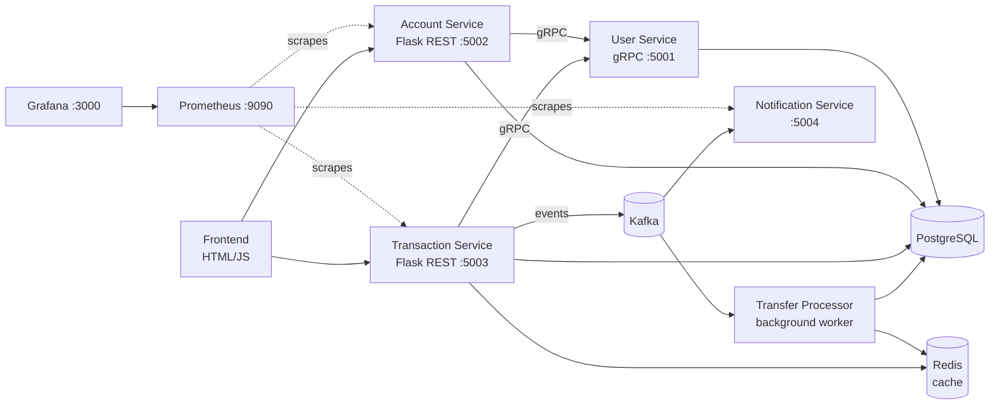

# BookKeeping — Banking Microservices Platform


An event-driven banking system built with Python microservices. Supports user management with two-factor authentication (OTP), role-based access control, money transfers with an approval workflow, and full observability with Prometheus and Grafana.

## Architecture



| Service | Protocol | Responsibility |
|---|---|---|
| **user-service** | gRPC | Registration, login (JWT), OTP verification & resend, token validation |
| **account-service** | REST (Flask) | Account creation and queries, protected by auth middleware |
| **transaction-service** | REST (Flask) | Deposits, withdrawals, transfers, approval workflow, history |
| **transfer-processor** | Kafka consumer | Asynchronous execution of approved transfers |
| **notification-service** | Kafka consumer | Event-driven user notifications |

## Key Features

- **Two-factor authentication** — JWT login followed by OTP verification, implemented in the user service over gRPC (`VerifyOTP`, `ResendOTP`).
- **Role-based access control** — `admin` / `user` / `viewer` roles enforced with a `@require_role` decorator on REST endpoints.
- **Transfer approval workflow** — transfers move through `pending → approved → completed`; small transfers are auto-approved, larger ones require explicit approval (`/transfers/<id>/approve` or `/decline`).
- **Event-driven processing** — Kafka decouples the transaction API from transfer execution and notifications.
- **Caching** — Redis caches transfer status for fast lookups.
- **Observability** — every REST service exposes metrics via shared middleware; Prometheus scrapes them and Grafana visualizes.
- **CI/CD** — GitHub Actions builds a Docker image per service (matrix build) and pushes to DockerHub on every push to `main`.

## Tech Stack

Python 3.11 · Flask · gRPC (protobuf) · Kafka · Redis · PostgreSQL 13 · Docker & Docker Compose · Prometheus · Grafana · GitHub Actions

## Getting Started

```bash
git clone https://github.com/ori-leibovitz/BookKeeping.git
cd BookKeeping
docker-compose up -d
```

Services come up on:

| Component | Port |
|---|---|
| User service (gRPC) | 5001 |
| Account service | 5002 |
| Transaction service | 5003 |
| Notification service | 5004 |
| PostgreSQL | 5432 |
| Kafka | 9092 / 9093 |
| Redis | 6379 |
| Prometheus | 9090 |
| Grafana | 3000 |

Database schema is defined in [`tables.sql`](tables.sql). All ports are configurable via environment variables (see `docker-compose.yml`).

## Testing

End-to-end test suites run against the live composed environment:

```bash
python test_complete_workflow.py   # full transfer workflow (pending → approved → completed)
python test_roles.py               # RBAC: admin / user / viewer permissions
python test_opt_workflow.py        # OTP two-factor login flow
python test_error_handling.py      # error paths and edge cases
python test_api.py                 # basic API coverage
```

## Monitoring

- **Prometheus** — http://localhost:9090 (scrape targets defined in `prometheus.yml`)
- **Grafana** — http://localhost:3000 (add Prometheus as a data source at `http://prometheus:9090`)
